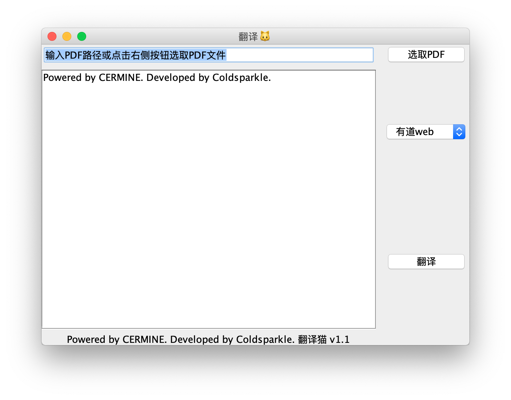

[TOC]
# PDFTranslator

一个用于将PDF格式的英文文档翻译为中文txt文档的翻译器.
 
 此项目，使用了如下开源库：[CERMINE](https://github.com/CeON/CERMINE)，
[fastjson](https://github.com/alibaba/fastjson)

### 构建过程
1.`git clone https://gitee.com/coldsparkle/PdfTranslator.git`

2.在Intellij IDEA中打开项目，等待maven下载依赖包

3.编辑`ml/areostech/BaiduTranslator.kt`，修改`APPID`和`APP_KEY`为你的

4.点击IDEA右侧`Maven`,选择`package`
    

### 软件使用

1.直接在文本框中输入文件路径或点击右上侧`选取PDF`按钮选取文件

2.点击`有道web`下拉选择框切换翻译源(可选),共有三种翻译源：`某道网页版翻译`，`某道免费版`，`百度翻译`

3.点击翻译等待解析和翻译，翻译完成后结果保存于源PDF文件路径中，文件名为`源pdf文件名.txt`

**MIT Licensed**